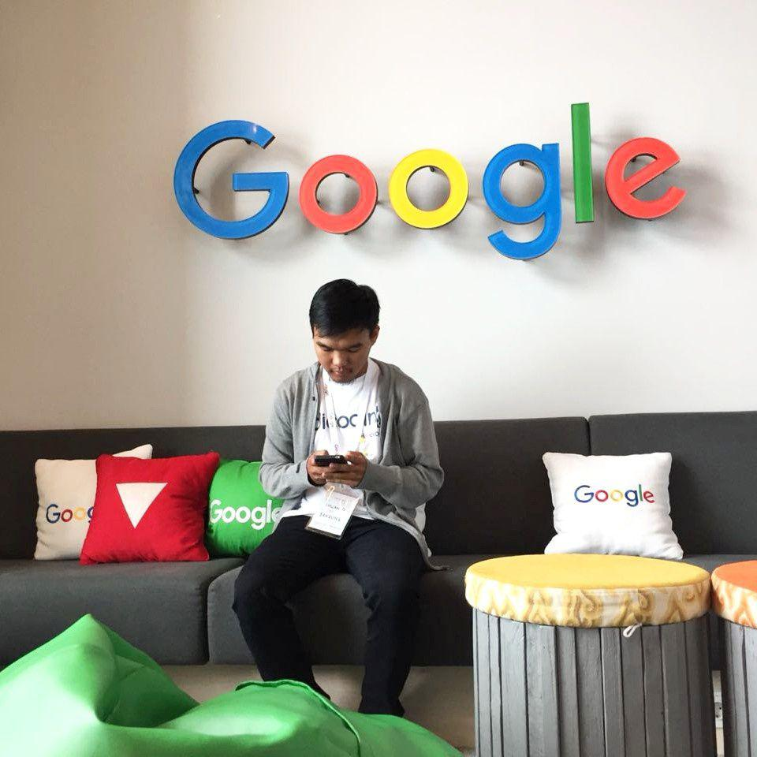

Halo saya Ihwan, Associate Android Developer, penulis dan pembelajar sepanjang masa asal Majalengka. Saya senang menulis dan membuat video, beberapa portofolio tulisan dan video saya bisa dilihat di blog ini dan channel youtube saya. 

Awalnya saya membuat blog ini untuk mendokumentasikan apapun yang sudah saya pelajari dan berbagi pengalaman yang sudah saya alami. Semoga blog ini bisa berguna dan membantu para pembaca sekalian. 

### Portofolio

- GitHub: [IhwanID](https://github.com/IhwanID)
- Youtube: [IhwanD](https://www.youtube.com/channel/UCjntzibNSsjjIOh0HoP9vxw)
- Medium: [ihwanid](https://medium.com/@ihwanid)

## Currently Using

- **Computer:** MacBook Pro 2012, Acer E5 475G
- **Hosting:** [Netlify](https://netlify.com)
- **Editor:** [Visual Studio Code](https://code.visualstudio.com/),[Android Studio](https://developer.android.com/studio)
- **Programming Language:** Java, Kotlin, Dart, PHP, Go